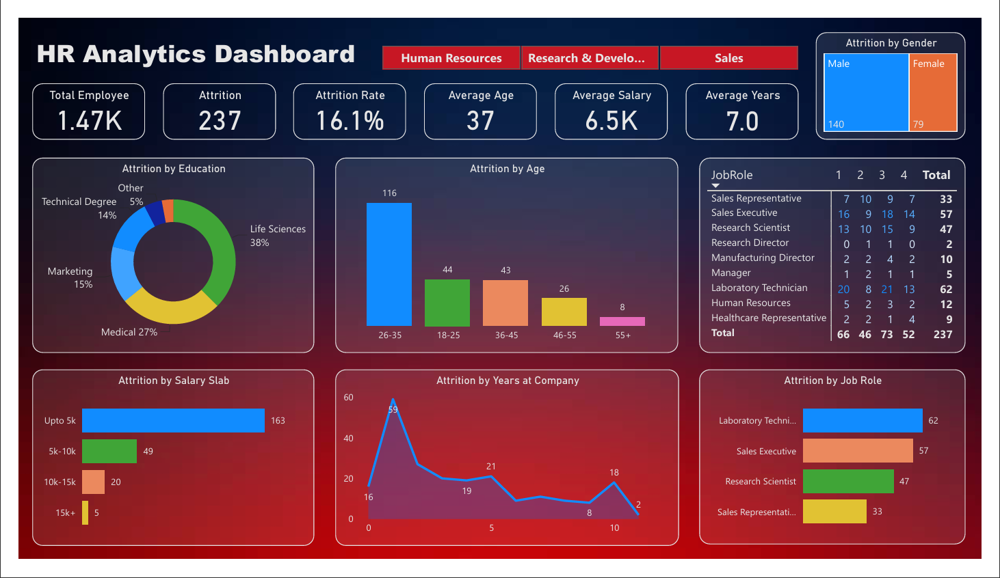

# HR Analytics Dashboard

An interactive **HR Analytics Dashboard** built in **Power BI** to analyze employee attrition, workforce demographics, salary distribution, and key HR metrics. The dashboard provides valuable insights into employee turnover patterns and supports data-driven HR decision-making.

---

## Dashboard Preview



---

## Project Overview

This project analyzes HR employee data to identify trends and patterns related to workforce attrition. The dashboard presents key HR metrics through interactive visualizations, enabling users to explore employee demographics, salary distribution, education, job roles, and years at the company.

It is designed to help HR professionals monitor workforce performance, identify areas with high attrition, and gain meaningful insights for employee retention.

---

## Key Performance Indicators (KPIs)

- **Total Employees:** 1.47K
- **Attrition Count:** 237
- **Attrition Rate:** 16.1%
- **Average Age:** 37 Years
- **Average Salary:** 6.5K
- **Average Years at Company:** 7.0 Years

---

## Dashboard Features

- Interactive KPI cards
- Department-wise filtering using slicers
- Attrition by Education
- Attrition by Age Group
- Attrition by Gender
- Attrition by Salary Slab
- Attrition by Job Role
- Attrition by Years at Company
- Job Role-wise attrition matrix
- Dynamic and interactive visualizations

---

## Project Highlights

- Built an interactive HR Analytics Dashboard using Power BI Desktop.
- Cleaned and transformed HR data using Power Query.
- Used DAX measures to calculate key HR metrics.
- Created calculated columns to categorize employee data.
- Designed interactive dashboards using KPI cards, slicers, charts, and matrix visuals.
- Applied data modeling to build meaningful business insights.

---

## DAX Used

### Measures

- **AttritionRate**
- **AverageAge**

### Calculated Columns

- **AgeGroup**
- **SalarySlab**

---

## Key Insights

- Employees aged **26–35** have the highest attrition.
- Employees earning **up to 5K** contribute the highest attrition.
- **Life Sciences** has the highest attrition among education fields.
- **Laboratory Technicians** and **Sales Executives** show the highest attrition.
- Male employees account for a higher number of attrition cases than female employees.
- Department slicers enable quick comparison across Human Resources, Research & Development, and Sales.

---

## Tools & Technologies

- Power BI Desktop
- Power Query
- DAX
- Data Modeling
- Interactive Visualizations

---

## Dataset

The dataset includes HR employee information such as:

- Employee ID
- Age
- Gender
- Department
- Education
- Education Field
- Job Role
- Monthly Income
- Business Travel
- Years at Company
- Job Satisfaction
- Work-Life Balance
- Performance Rating
- Attrition Status

---

## Repository Structure

```text
HR-Analytics-Dashboard
│
├── Dashboard
│   ├── HR_Analytics_Dashboard.pbix
│   └── HR_Analytics_Dashboard.pdf
│
├── Dataset
│   └── HR_Analytics.csv
│
├── Images
│   └── Dashboard.png
│
└── README.md
```

---

## How to Use

1. Clone or download this repository.
2. Open the `.pbix` file using **Power BI Desktop**.
3. Refresh the data if required.
4. Explore the dashboard using the department slicers and interactive visuals.

---

## Skills Demonstrated

- Data Cleaning
- Data Transformation
- Data Modeling
- DAX
- Power Query
- Dashboard Design
- Data Visualization
- Business Intelligence
- HR Analytics
- Interactive Reporting

---

## Future Improvements

- Add drill-through pages for detailed employee analysis.
- Include time-based trend analysis.
- Connect the dashboard to a live data source.
- Extend the dashboard with predictive HR analytics.

---

## Author

**Hrithik Doiphode**

## License

This project is intended for learning, portfolio, and demonstration purposes.
