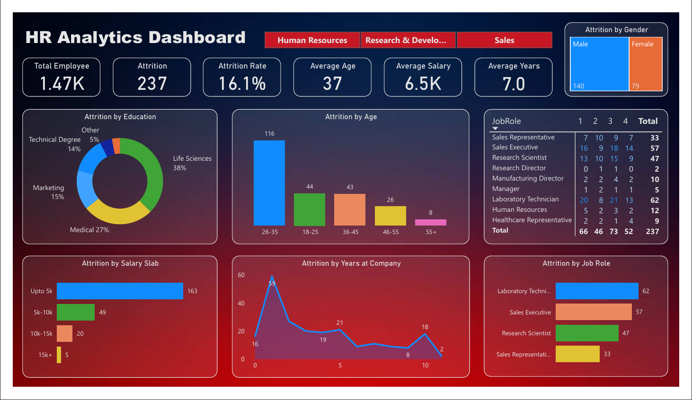

# HR Analytics Dashboard

An interactive Power BI dashboard that analyzes employee attrition, workforce demographics, salary distribution and job roles. It shows where attrition is concentrated and which groups are most likely to leave.

## Dashboard Preview



## Dataset

- `HR_Analytics.csv`: 1,480 rows and 38 columns. Ten employee IDs appear twice, so the dashboard reports the 1,470 unique employees.
- Fields include age, gender, department, job role, education field, monthly income, job satisfaction, years at company and attrition status.

## Key Metrics

| Metric | Value |
|---|---|
| Total employees | 1,470 |
| Attrition (employees who left) | 237 |
| Attrition rate | 16.1% |
| Average age | 37 |
| Average monthly income | 6.5K |
| Average years at company | 7.0 |

## Key Insights

The dashboard shows attrition counts. The rates below (leavers as a share of each group) show where the risk is highest.

- **Sales Representatives leave most often**: a 39.8% attrition rate, against 16.1% overall. Laboratory Technicians have the most leavers (62), with a 23.9% rate.
- **Younger employees are the highest risk.** Ages 18-25 have a 35.8% attrition rate. Ages 26-35 have the most leavers (116) at a 19.1% rate, and ages 36-45 have the lowest rate (9.2%).
- **Low pay is linked to leaving.** Employees earning up to 5K account for 163 of the 237 leavers (68.8%), with a 21.8% rate. Employees earning 15K or more have a 3.8% rate.
- **The first year is the danger point.** More employees leave after 1 year at the company (59) than at any other tenure.
- **Sales has the highest departmental rate** (20.6%), ahead of Human Resources (19.0%) and Research & Development (13.8%).
- **Male employees leave slightly more often**: 150 leavers (17.0% rate) against 87 for female employees (14.8%).

### Additional findings from the dataset (not on the dashboard)

- Employees who work overtime have a 30.5% attrition rate, against 10.4% for those who do not.
- Single employees have a 25.5% attrition rate, against 12.5% for married employees.

## Dashboard Features

- KPI cards: total employees, attrition, attrition rate, average age, average income, average years at company
- Department slicers (Human Resources, Research & Development, Sales)
- Attrition by gender, education field, age group, salary slab, years at company and job role
- Job role matrix showing attrition by job satisfaction level (1 to 4)

## Power BI Work

- Loaded and prepared the HR dataset in Power BI Desktop
- DAX measures: `AttritionRate`, `AverageAge`
- Categories for age group and salary slab
- Interactive report with cards, slicers, a matrix and charts

## Repository Structure

```text
HR-Analytics-Dashboard/
├── Dashboard/
│   ├── HR_Analytics_Dashboard.pbix
│   └── HR_Analytics_Dashboard.pdf
├── Dataset/
│   └── HR_Analytics.csv
├── Images/
│   └── Dashboard.png
└── README.md
```

## How to Use

1. Download the repository.
2. Open `HR_Analytics_Dashboard.pbix` in Power BI Desktop.
3. Click a department in the slicer to filter every visual.

## Author

**Hrithik Doiphode**

GitHub: https://github.com/Hrithikdoi
